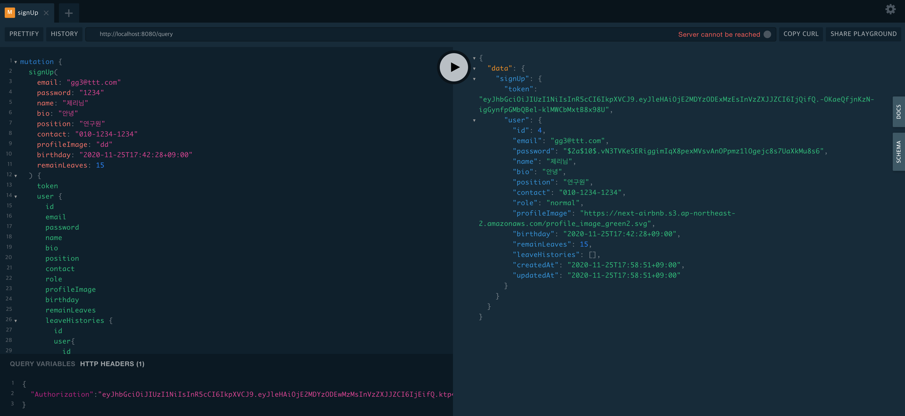

to merge '.graphql' in '/schema'

> $ gqlmerge --indent=2s schema schema.graphql

to generate gqlgen with 'schema.graphql'

> $ gqlgen generate

graph안에 model이 자동으로 생성이 된다. 하지만 gorm 설정이 사라지므로 models_gen_backup에 저장하여 사용하였 습니다다.

graph/resolver.go와 graph/schema.resolver.go에 리졸버가 자동의로 생성되는데 이것을 server.go에서 불러와 아래 코드에서 사용한다.

```
	h := handler.NewDefaultServer(generated.NewExecutableSchema(generated.Config{Resolvers: &graph.Resolver{}}))
```

resolver를 한 파일에 관리하는 것은 불편하므로 resolver폴더를 만들어 리졸버들을 따로 작성할 수 있도록 하였습니다.

to start & reloading server

> nodemon --exec go run server.go --signal SIGTERM


